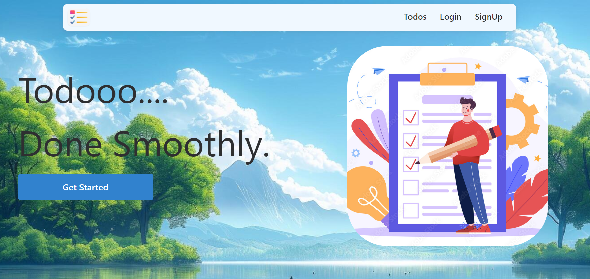
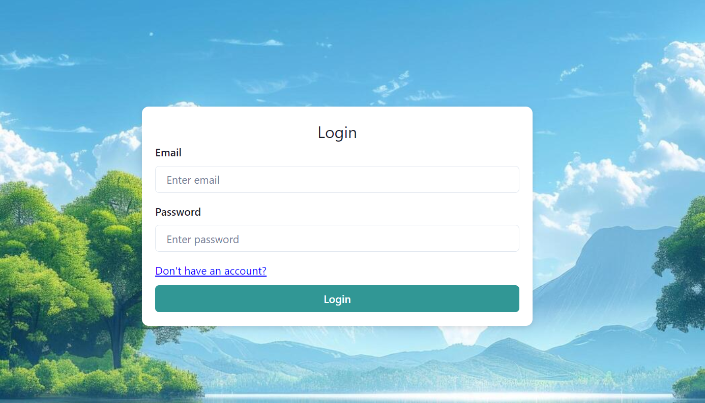
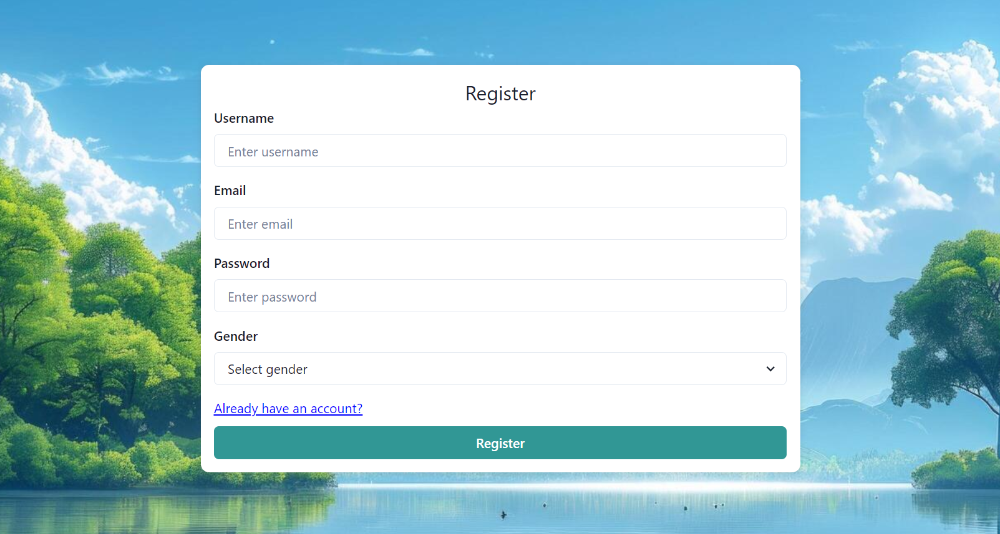
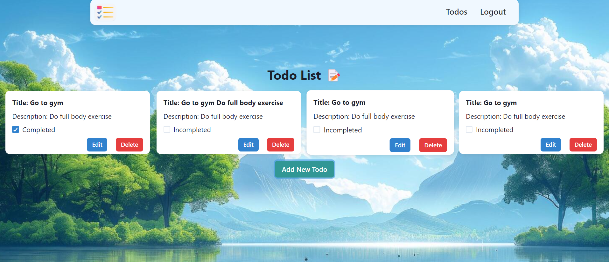
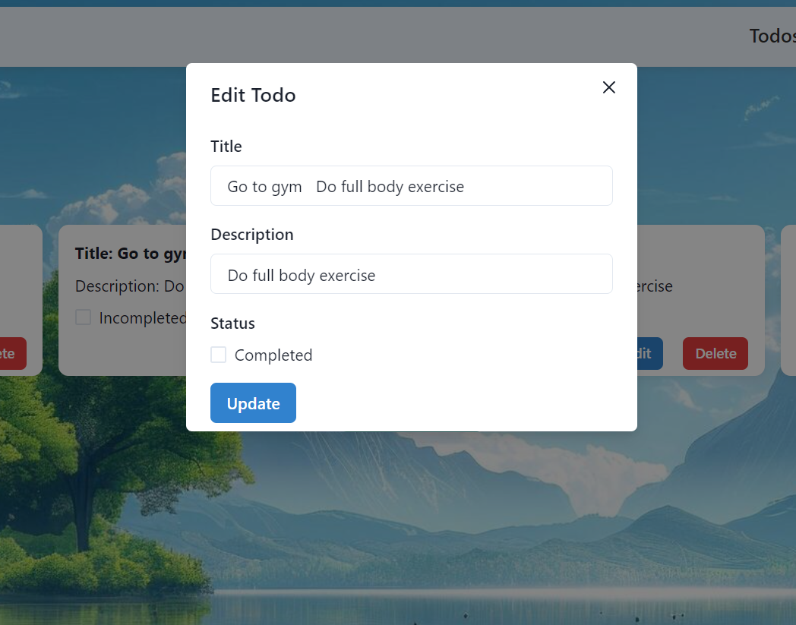

# 📝 Todoiest - Full Stack Todo App

Welcome to **Todoiest**, a full-stack todo application where you can manage your tasks effortlessly! This app allows users to register, log in, add, update, and delete their todo items. It's fully responsive and designed with simplicity and efficiency in mind.

## 📖 About the App

**Todoiest** is a simple and efficient full-stack application built to help users stay organized with their daily tasks. Whether it's creating a new task, editing an existing one, or removing completed tasks, Todoiest allows users to manage their todos with ease. The app is designed to be user-friendly and responsive, so you can use it on any device, anytime!

### How It Works:
1. **Register**: Create an account to start managing your tasks.
2. **Login**: Access your account by logging in with your credentials.
3. **Add Todo**: Create new tasks and keep track of what needs to be done.
4. **Update Todo**: Edit tasks as needed.
5. **Delete Todo**: Remove tasks once they're completed.

## 🚀 Features
- 🔑 **Login / Logout**
- 📝 **Register**
- ➕ **Add New Todo**
- ✏️ **Update Existing Todo**
- ❌ **Delete Todo**
- 📱 **Full Responsive Design**

## 🌐 Live Demo
Check out the deployed app here: [Todoiest App](https://todoeist-application.netlify.app/)

## 💻 Tech Stack

### Frontend:
- ⚛️ React
- 🖼️ HTML, CSS, JavaScript
- 💡 Chakra UI

### Backend:
- 🗄️ MongoDB
- 🌐 Express
- 🖥️ Node.js
- 📊 Mongoose

## 🖼️ Project Pages

### 🏠 Home Page

### 🔐 Login Page

### 📝 Register Page

### ✅ Todos Page

### ✏️ Update Todo Page

## 📂 Backend Repository
You can find the backend code in this repository: [Todo Backend](https://github.com/Dhanushs3103/Todo-Backend)

## 🙌 Feedback
Feel free to provide feedback or suggestions to help me improve the app. We'd love to hear from you! 😊
